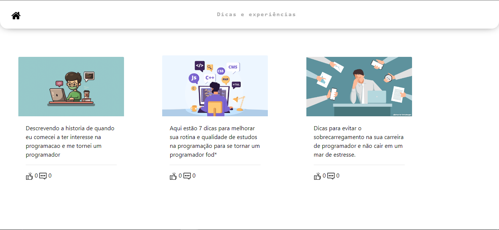

<h1 align="center">Blog</h1>

  

Click here to access the <a href="https://web-production-a8a4.up.railway.app/" target="_blank">website</a>.

<h2>Resume</h2>

  This is a project where I will publish about my experiences in the programming area and also leave some tips on things
  which I think are the most important to observe in a career as a programmer. Over time, I will post new articles with
  new content that can be of considerable help to all programmers.

<h2>About the project</h2>

  This project was developed using the Django framework in conjunction with the Python programming language, and also makes use of
  Bootstrap for creating a responsive and user-friendly interface.
  
  The objective of the project is to offer a platform for the author to share their experiences and knowledge in the field of
  programming, including useful tips and advice for those who are starting or already working in a programming career.
  
  Using Django and Python, the author can create a robust and scalable web application with a content management system
  intuitive and efficient. This allows new articles to be published easily, and users can find and
  navigate through content in a simple and organized way.

<h2 align="center">Technologies used</h2>

  
  
  
  
  

